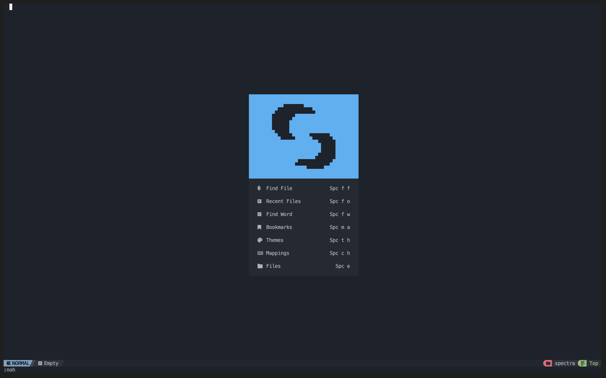

<h1 align="center">NvChad - Spectrasonic's Fork</h1>
## Install

**HTTP**

```bash
git clone -q https://github.com/spectrasonic117/NvChad.git ~/.config/nvim --depth 1 && nvim
```

**SSH**

```bash
git clone -q git@github.com:spectrasonic117/NvChad.git ~/.config/nvim --depth 1 && nvim

```

## Showcase



## What is it?

-   NvChad is a neovim config written in lua aiming to provide a base configuration with very beautiful UI and blazing fast startuptime (around 0.02 secs ~ 0.07 secs). We tweak UI plugins such as telescope, nvim-tree, bufferline etc well to provide an aesthetic UI experience.

-   Lazy loading is done 93% of the time meaning that plugins will not be loaded by default, they will be loaded only when required also at specific commands, events etc. This lowers the startuptime and it was like 0.07~ secs tested on an old pentium machine 1.4ghz + 4gb ram & HDD.

-   NvChad isn't a framework! It's supposed to be used as a "base" config, so users can tweak the defaults well, and also remove the things they don't like in the default config and build their config on top of it. Users can tweak the entire default config while staying in their custom config (lua/custom dir). This is the control center of the user's config and gitignored so the users can stay up-to-date with NvChad's latest config (main branch) while still controlling it with their chadrc (file that controls entire custom dir).

## Theme Showcase

<details><summary> <b>Images (Click to expand!)</b></summary>


(Note: these are just 4-5 themes, NvChad has around 56 themes)

</details>

## UI related plugins used

<details><summary> <b>Images (Click to expand!)</b></summary>

<h3> Nvim-tree.lua </h3>

Fast file tree:

<kbd></kbd>

<h3> Telescope-nvim </h3>

A fuzzy file finder, picker, sorter, previewer and much more:

<kbd></kbd>

<h3> Our own statusline written from scratch  </h3>

[NvChad UI](https://github.com/NvChad/ui)

<kbd></kbd>

<h3> Tabufline (our own pertab bufferline) </h3>

<kbd></kbd>

-   Here's a [video](https://www.youtube.com/watch?v=V_9iJ96U_k8&ab_channel=siduck) that showcases it.

<h3> NvCheatsheet ( our UI Plugin ) </h3>
<kbd> </kbd>

</details>

## Plugins list

-   Many beautiful themes, theme toggler by our [base46 plugin](https://github.com/NvChad/base46)
-   Inbuilt terminal toggling & management with [Nvterm](https://github.com/NvChad/nvterm)
-   NvChad updater, hide & unhide terminal buffers with [NvChad extensions](https://github.com/NvChad/extensions)
-   Lightweight & performant ui plugin with [NvChad UI](https://github.com/NvChad/ui) It provides statusline modules, tabufline ( tabs + buffer manager) , beautiful cheatsheets and much more!
-   File navigation with [nvim-tree.lua](https://github.com/kyazdani42/nvim-tree.lua)
-   Beautiful and configurable icons with [nvim-web-devicons](https://github.com/kyazdani42/nvim-web-devicons)
-   Git diffs and more with [gitsigns.nvim](https://github.com/lewis6991/gitsigns.nvim)
-   NeoVim Lsp configuration with [nvim-lspconfig](https://github.com/neovim/nvim-lspconfig) and [mason.nvim](https://github.com/williamboman/mason.nvim)
-   Autocompletion with [nvim-cmp](https://github.com/hrsh7th/nvim-cmp)
-   File searching, previewing image and text files and more with [telescope.nvim](https://github.com/nvim-telescope/telescope.nvim).
-   Syntax highlighting with [nvim-treesitter](https://github.com/nvim-treesitter/nvim-treesitter)
-   Autoclosing braces and html tags with [nvim-autopairs](https://github.com/windwp/nvim-autopairs)
-   Indentlines with [indent-blankline.nvim](https://github.com/lukas-reineke/indent-blankline.nvim)
-   Useful snippets with [friendly snippets](https://github.com/rafamadriz/friendly-snippets) + [LuaSnip](https://github.com/L3MON4D3/LuaSnip).
-   Popup mappings keysheet [whichkey.nvim](https://github.com/folke/which-key.nvim)

## :gift_heart: Support

If you like NvChad and would like to support & appreciate it via donation then I'll gladly accept it.

[](https://ko-fi.com/siduck)
[](https://paypal.me/siduck76)
[](https://www.buymeacoffee.com/siduck)
[](https://www.patreon.com/siduck)

## Credits

-   [Elianiva](https://github.com/elianiva) helped me with NeoVim Lua related issues many times, NvChad wouldn't exist without his help at all as he helped me in my initial neovim journey!
-   @lorvethe for making the beautiful NvChad logo.

-   The original creator of NVChad (Oviously)
